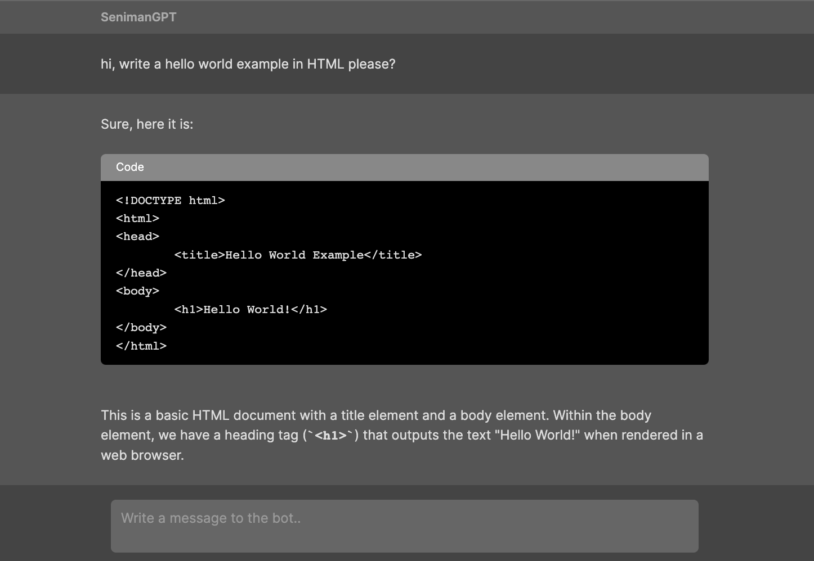

# seniman-chatgpt
A ChatGPT UI built in [Seniman](https://github.com/senimanjs/seniman).



## Set up the app
1. Clone this repository
2. Install the dependencies
```bash
npm install
```
3. Run the build script
```bash
npm run build
```
4. Start the server (passing your OpenAI API key as an environment variable)
```bash
OPENAI_API_KEY=<...> npm start
```
Get your OpenAI API key [here](https://platform.openai.com/account/api-keys).

5. Open the app at `http://localhost:3020`

## Network Performance
Compared to OpenAI's native `chat.openai.com`'s frontend:

OpenAI
- downloads 600KB of JS upfront 
- ~160KB of data per message (short code block + 5 sentence paragraph)

Seniman
- downloads 3KB of JS upfront & 3KB of websocket messages to set up UI
- ~5KB of WS data per message of same size